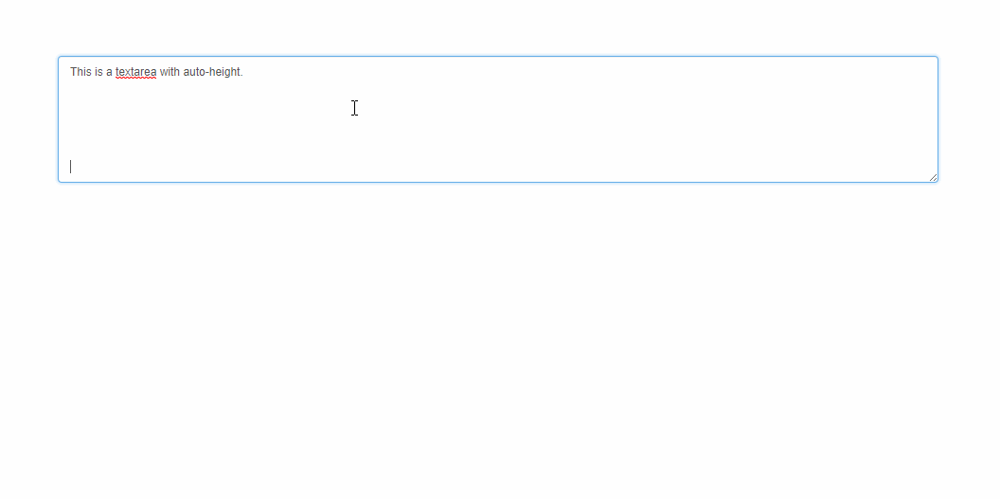

# ct-adc-auto-resize-textarea

## 目录

- [Build Setup](#build-setup)
- [在线演示](#在线演示)
- [依赖](#依赖)
- [缺陷](#缺陷)


## Build Setup

``` bash
# install dependencies
npm install

# serve with hot reload at localhost:8080
npm run dev

# build for production with minification
npm run build

# build for production and view the bundle analyzer report
npm run build --report
```

For detailed explanation on how things work, checkout the [guide](http://vuejs-templates.github.io/webpack/) and [docs for vue-loader](http://vuejs.github.io/vue-loader).

## 在线演示

在线演示: [go to live demo](http://htmlpreview.github.io/?https://github.com/ct-adc/ct-adc-auto-resize-textarea/blob/master/view/demo.html).



## 依赖

依赖 [jackmoore/autosize](https://github.com/jackmoore/autosize)，做了少许修改

## 缺陷

应当避免使用 `v-model.trim`。实际 `textarea` 的 `native.value` 是没有 `trim` 过，会导致 `native.value` 的长度达到 `maxlength` 上限，而外部 `v-model.trim` 的长度偏小，但是已经不能再输入。

> 矛盾：
> - 使用 `trim`，为什么还需要换行？
> - 使用 `trim`，就是不输入字符，无限换行操作？无限后，末尾还能输入？还能输不是超出了？

## 坑

- 如果使用 modal 弹窗，由于元素开始隐藏，而弹窗出现有 300ms 过渡时间，可能导致初始化的时候，不会自动 autosize